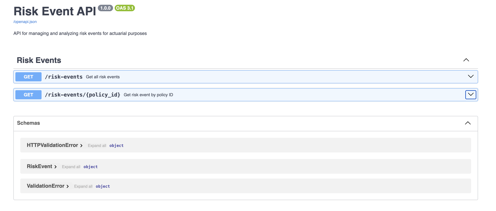
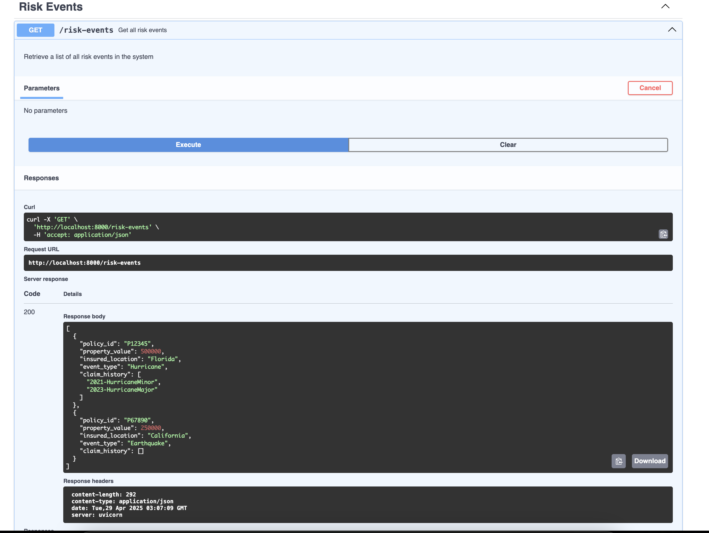
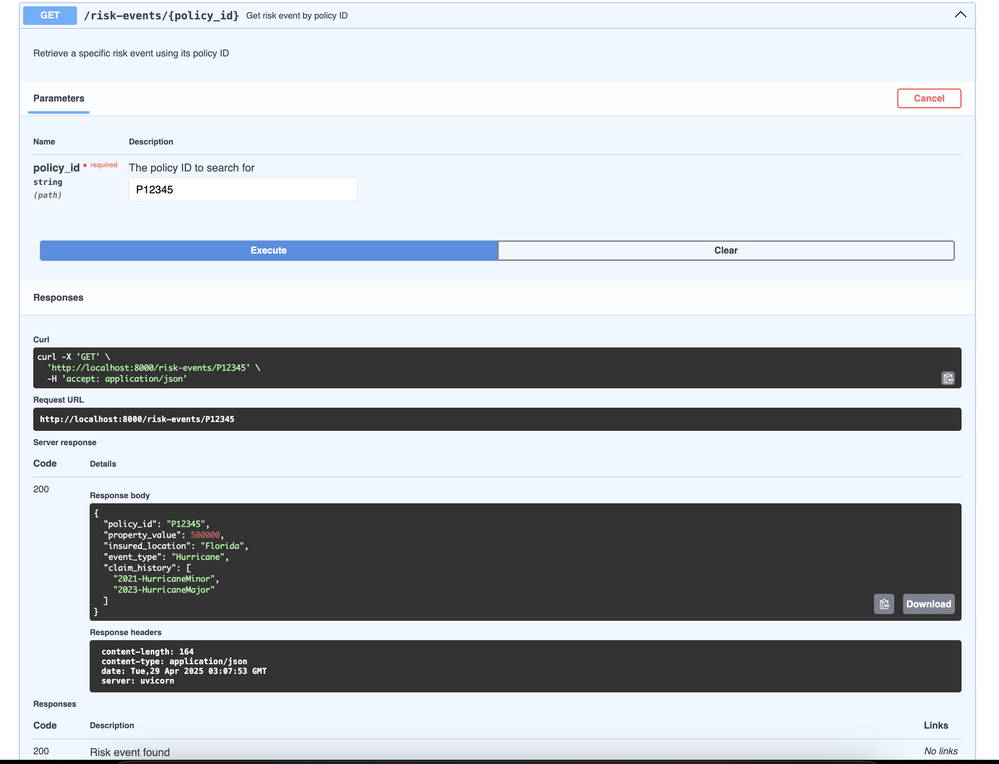
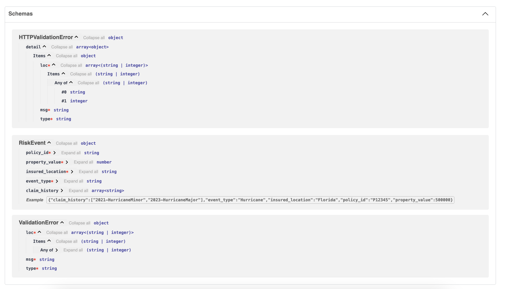

# Risk Event API

A FastAPI-based service for managing and analyzing risk events for actuarial purposes. This API provides endpoints to retrieve risk event data, including policy information, property values, and claim history.

## Features

- RESTful API endpoints for risk event management
- In-memory data storage (for demonstration purposes)
- Pydantic models for data validation
- FastAPI automatic documentation with examples and detailed descriptions
- OpenAPI (Swagger) and ReDoc documentation
- Proper error handling with status codes

## Setup

1. Create a virtual environment:
```bash
python -m venv venv
source venv/bin/activate  # On Windows: venv\Scripts\activate
```

2. Install dependencies:
```bash
pip install -r requirements.txt
```

3. Run the application:
```bash
uvicorn main:app --reload
```

The API will be available at `http://localhost:8000`

## API Documentation

Once the server is running, you can access the interactive API documentation at:
- Swagger UI: `http://localhost:8000/api/docs`
- ReDoc: `http://localhost:8000/api/redoc`

The documentation includes:
- Detailed endpoint descriptions
- Request/response examples
- Schema definitions
- Error responses
- Interactive API testing interface (Swagger UI)

## API Endpoints

### GET /risk-events
Returns all risk events in the system.

Example response:
```json
[
    {
        "policy_id": "P12345",
        "property_value": 500000,
        "insured_location": "Florida",
        "event_type": "Hurricane",
        "claim_history": ["2021-HurricaneMinor", "2023-HurricaneMajor"]
    }
]
```

### GET /risk-events/{policy_id}
Returns a specific risk event by policy ID.

Example response:
```json
{
    "policy_id": "P12345",
    "property_value": 500000,
    "insured_location": "Florida",
    "event_type": "Hurricane",
    "claim_history": ["2021-HurricaneMinor", "2023-HurricaneMajor"]
}
```

Error response (404 Not Found):
```json
{
    "detail": "Policy not found"
}
```

## Data Model

The risk event model includes:
- `policy_id`: Unique identifier for the insurance policy
- `property_value`: Monetary value of the insured property
- `insured_location`: Geographic location of the insured property
- `event_type`: Type of risk event (e.g., Hurricane, Earthquake)
- `claim_history`: List of previous claims associated with the policy

## Development

This is a demonstration project using FastAPI. For production use, you would want to:
- Implement a proper database backend
- Add authentication and authorization
- Include more comprehensive error handling
- Add additional endpoints for data manipulation
- Implement proper logging and monitoring





